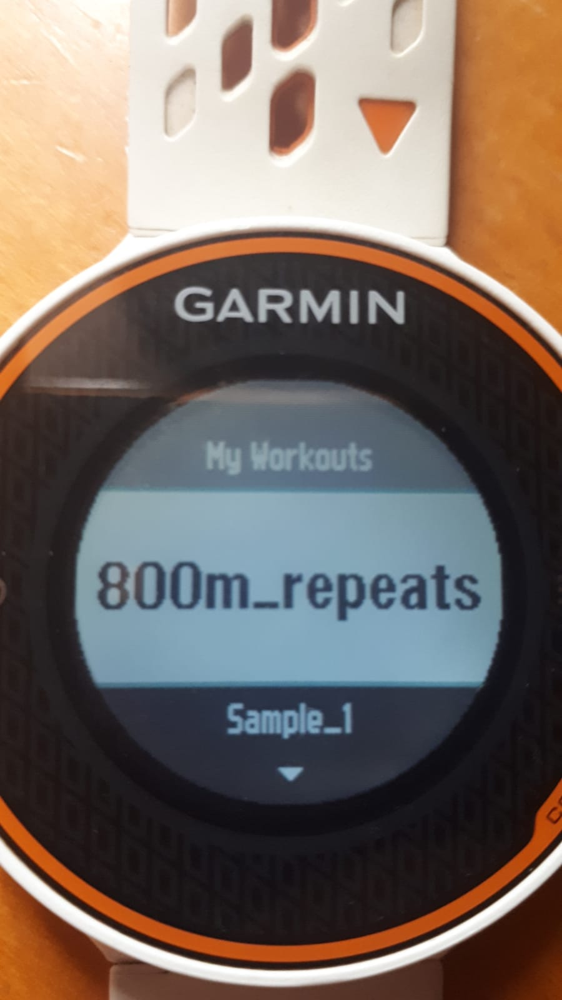
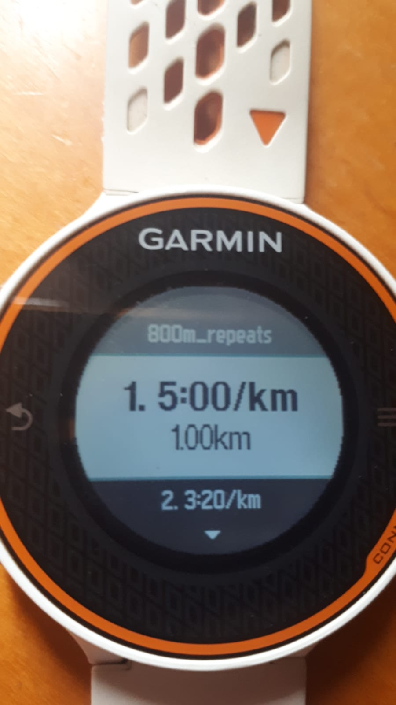
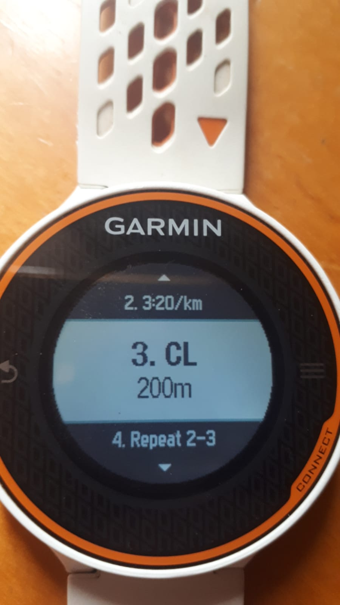
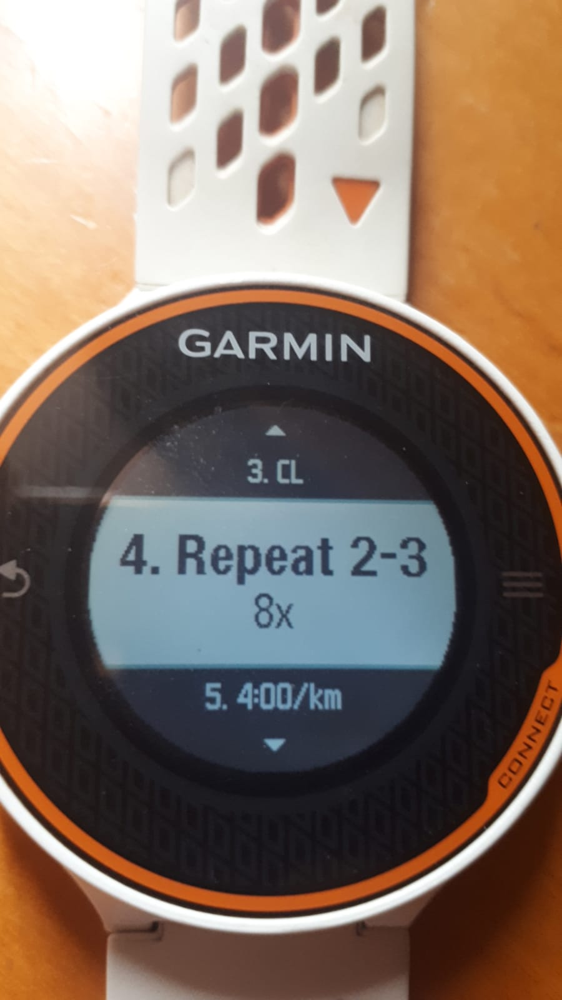

# Runlang

Runlang is a DSL to generate running workouts that can be exported to devices
such as Garmin. It ships with a command line tool that generates the workout
program from an input string. Currently the tool supports only exporting to
[Fit](https://developer.garmin.com/fit/overview/) files, which are supported by
Garmin devices. The goal of this project is to create a tool that enables users
to define workouts conveniently and automate synchronization with fitness apps
and devices. The tool automatically detects Garmin devices connected to the
computer, and generates the Fit workout file corresponding to the input string.
Here's a sample:

```shell
runlang -n "800m repeats" "1km 5:00/km + 8x(800m 3:20/km + 200m CL) + 1km 4:00/km"
```

Here **CL** means light walk. See the section below for more details.

If a Garmin device is connected via USB, it'll export automatically to the
`NEWFILES` folder, and the device will auto-update when you detach it. The
workout then will show up on the `My Workouts` menu. Here's
what this export looks like on my Forerunner 620:

     

## The language

Runlang defines a workout definition language that is succinct and simple to
understand. It's based on the template used by the coaching staff of [G5
Esportes](https://g5esportes.com/). Currently, it only supports metric system
units (meters, kilometers and minutes/km). The template that the language was
based also defines _running terms_. Each term corresponds to a degree on a scale
of the [Perceived Subjective
Exertion](https://www.cdc.gov/physicalactivity/basics/measuring/exertion.htm).
The terms also have an approximate correspondence with a heart zone and a pace
for a given running event. The terms are defined as:

- **CL**: Light walk (_Caminhada leve_). Heart zone 1 and pace should be lighter
  than an average walk.
- **CA**: Walking normally (_Caminhada_). Heart zone 1 and should feel like a
  normal walk.
- **CV**: Vigorous walk (_Caminhada vigorosa_). Heart zone 1 and should feel
  like a fast walk.
- **TR**: Lightest pace (_Trote_). Heart zone 1, and should be the "natural"
  pace
  when you start running.
- **LVS**: Very light pace (_Levíssimo_). Heart zone 1 or 2, and should be very
  light, just a little above your "natural" pace
- **LE**: Light pace (_Leve_). Heart zone 2 or 3, should feel tiring if
  sustained for very long, but should take effort.
- **MO**: Moderate pace (_Moderado_). Heart zone 3 and should feel moderate.
  Usually you would run up to a half marathon at this pace.
- **FO**: Strong pace (_Forte_). Heart zone 3 or 4, should feel tiring. Usually
  you would run up to 10km at this pace.
- **FTS**: Very strong pace (_Fortíssimo_). Heart zone 4 or 5, should feel very
  difficult. You would run up to 3km-5km at this pace.
- **MAX**: Maximum pace (_Máximo_). Heart zone 5, and should be fiendishly
  difficult. At this pace you should be able to run at best 1km.

**These are approximate correspondences based on my personal experience and are
not an absolute truth. The use of the terms is overall subjective, given that
they are based on a subjective scale. Take the 3000m test and talk to your
coach or look up some articles on how to calculate this.**

The syntax is based on steps that are composed with addition to compose a
workout. Any composition of steps can be repeated a number of times. The
AST (Abstract Syntax Tree) is called workout tree.

Here are some examples of valid workout strings:

- Simple workout, absolute measures:

  ```txt
  5km 6:00/km
  ```

  It reads as 5 kilometers, at a pace of 6 minutes per kilometer

- Another simple workout, defining a step with time and pace, which is
- equivalent to the above:

  ```txt
  30min 6:00/km
  ```

- A composed workout of multiple steps, using terms

  ```txt
  1.5km TR + 1.5km LE + 1.5km FO + 1.5km LVS
  ```

- A workout of 400m repeats, with warm-up and cool down

  ```txt
  1km TR / 10x(400m FTS / 100m CL) / 1km LE
  ```

- A progressive workout, starting at 4:50/km and accelerating up to 3:20/km
  every km for 15km

  ```txt
  15km 4:50/km->3:20/km:1km
  ```

  For more examples see the [unit
  tests](https://github.com/carlosganzerla/Runlang/blob/main/src/Runlang.Tests/Parser/LangParserTests.fs)
  for the `LangParser` module.

### Complete Grammar (BNF)

```bnf
<white_char> ::= " " | "\t" | "\r" | "\n"
<white> ::= <white_char>*
<white1> ::= <white_char>+
<zero_to_five> ::= "0" | "1" | "2" | "3" | "4" | "5"
<six_to_nine> ::= "6" | "7" | "8" | "9"

<digit> ::= <zero_to_five> | <six_to_nine>

<watch_digits> ::= <zero_to_five> <digit>
<base_sixty> ::= <watch_digits> | <digit>

<integer> ::= <digit> | <digit> <integer>

<decimal_separator> ::= "," | "."

<decimal> ::= <integer> <decimal_separator> <digit> | <integer>

<distance> ::= <integer> "m" | <decimal> "km"

<watch_time> ::= <base_sixty> ":" <watch_digits>
  | <integer> ":" <watch_digits> ":" <watch_digits>

<time> ::= <watch_time>
  | <base_sixty> ":" <watch_digits>
  | <base_sixty> "min"
  | <base_sixty> "s"
  | <base_sixty> "min" <base_sixty> "s"
  | <integer> "h" <base_sixty> "min" <base_sixty> "s"
  | <integer> "h" <base_sixty> "min"
  | <integer> "h" <base_sixty> "s"

<time_pace> ::= <watch_time> "/km"

<term_pace> ::= "CL"
  | "CA"
  | "CV"
  | "TR"
  | "LVS"
  | "LE"
  | "MO"
  | "FO"
  | "FTS"
  | "MAX"

<pace> ::= <time_pace> | <term_pace>

<progression> ::= <pace> "->" <pace> ":" <distance>

<plus> ::= "+" | "/"

<step> ::= <time> <white1> <distance>
  | <time> <white1> <pace>
  | <distance> <white1> <pace>
  | <distance> <white1> <progression>

<repeat> ::= <integer> "x" <white> "(" <white> <steps> <white> ")"

<workout_step> ::= <step> <white> | <repeat> <white>

<steps> ::= (<workout_step> (<plus> <white> <workout_step>)*)

<workout> ::= <white> <steps> <white>
```

## Using the CLI

The CLI is used to parse the input and export the workout. Additionally, you
may print an interval tree, that reads your pace table (translation of your
terms to a concrete pace value) and displays the stats of the input workout.
For more information on the pace table see the section below.

The usage of the CLi is as follows:

```shell
runlang [-o | --open] [-d | --display] [--table] [-n | --name] [-p | --path] [--no-file] <workout>
```

- Open distance mode `-o, --open` switch: This mode makes the exported Fit
  files define all distance durations as open duration, meaning that if you
  export a 1km step on open distance mode, it'll not auto-trigger on Garmin
  when you run it. The distance instead is put as the name of the step. This is
  useful for training on indoor environments or anywhere else the GPS gets
  messed up, and you have a distance reference on the ground (i.e. markers or
  known lap distance).
- Display interval tree `-d, --display` switch: Prints the interval tree on the
  console. An _interval_ describes the step in an absolute manner. It has the
  time, distance and pace of each step. Since the workout may be defined using
  the running terms, you must have a pace table file (see below). The pace
  table file will be looked up on the path that Runlang is running, by the name
  of `.pacetable`. If it's not found, it'll look for it on your home folder. In
  case it's not found there, the execution halts. Alternatively, you may pass a
  custom path using the `--table` option. If the supplied path is not found,
  the app fallbacks to the default lookup strategy.
- Workout name `-n, name` option: Defines the name of the workout on the Fit
  file. It's optional, and if not supplied, a default name will be assigned.
- Workout path: `-p, path` option: The path to export the workout. This is
  optional, since the app will detect your Garmin device. If a path is
  supplied, it will override the default path. If a path is not supplied, the
  file will be exported to the Garmin device. If the Garmin device is not
  found, the app will export the file to your home folder.
- No file switch `--no-file`: This switch is used when you don't want to export
  a file. It's useful to just play with the syntax, or just visualizing the
  interval tree.

### Pace table file

The pace table file defines the reference pace for each term, based on the
3000m test result. Here's my pace table, for example:

```txt
CL=11:06/km
CA=9:51/km
CV=8:52/km
TR=4:47/km
LVS=4:31/km
LE=4:14/km
MO=4:01/km
FO=3:42/km
FTS=3:25/km
MAX=2:57/km

```

I use it on my home folder under the name of `.pacetable`. You must
have a pace table file if you want to print the interval tree. Also, notice
that you must have a new line at the end of the file.

## Roadmap

The next obvious step is to integrate with Garmin Training API. This will allow
creating workouts and syncing with any device. A possible next step would be
also integrating with the Garmin calendar.

I didn't use the step targets because I don't find them really helpful in
practice, since pace floats sometimes and heart zone targets are useful only
for workout without many steps (i.e. constant pace run)

The language is based on a template that I've been consuming for a while. I
find it very simple and easy to understand. However, it's not cast in stone and
if it's useful to others to adapt to a more generic template or support other
constructs, this can be done without much problem I guess.

Issues and PRs are welcome.
